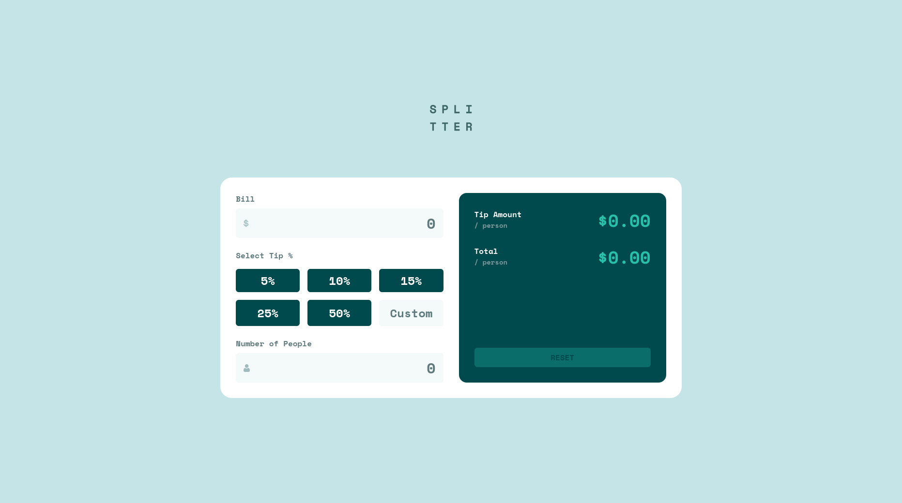
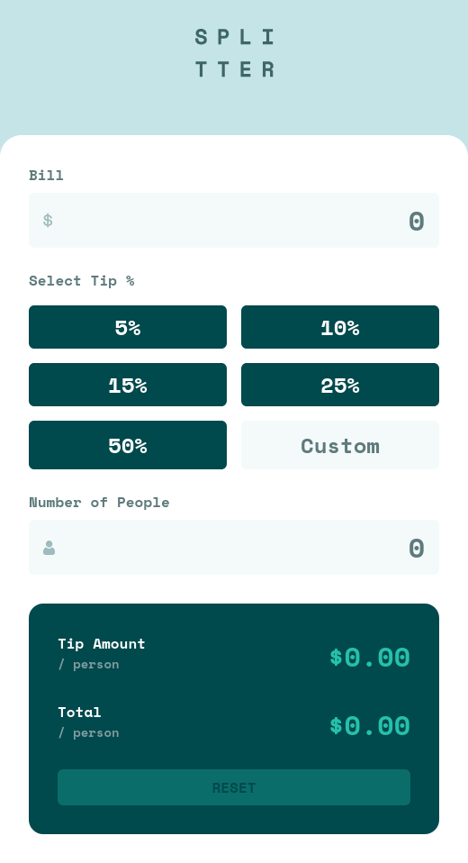

# Frontend Mentor - Tip calculator app solution

This is a solution to the [Tip calculator app challenge on Frontend Mentor](https://www.frontendmentor.io/challenges/tip-calculator-app-ugJNGbJUX). Frontend Mentor challenges help you improve your coding skills by building realistic projects.

## Table of contents

- [Overview](#overview)
  - [The challenge](#the-challenge)
  - [Screenshots](#screenshots)
  - [Links](#links)
- [My process](#my-process)
  - [Built with](#built-with)
  - [Useful resources](#useful-resources)
- [Author](#author)

## Overview

### The challenge

Users should be able to:

- View the optimal layout for the app depending on their device's screen size
- See hover states for all interactive elements on the page
- Calculate the correct tip and total cost of the bill per person

### Screenshots

#### Desktop

#### Mobile

### Links

- [Frontend Mentor solution](https://www.frontendmentor.io/solutions/tip-calculator-using-svelte-JCbx2hGM3-)
- [Live site](https://tip-calculator-react-theta.vercel.app/)

## My process

### Built with

- Semantic HTML5 markup
- Flexbox
- CSS Grid
- Mobile-first workflow
- [React](https://reactjs.org/) - JS library
- [Zustand](https://nextjs.org/) - State management library.
- [Tailwind CSS](https://tailwindcss.com/) - For styles.

### Useful Resources

- [Frontend Mentor's Introduction to Frontend Testing learning path](https://www.frontendmentor.io/learning-paths/introduction-to-front-end-testing-kacF_IJQO5) - This is the reason I revisited this challenge in React (I [originally did it in Svelte](https://github.com/mirror83/tip-calculator) in order to learn the framework a while back).
- [React Testing Library Tutorial by Robin Wieruch](https://www.robinwieruch.de/react-testing-library/) - A nice guide to the broad strokes of React Testing Library linked in the library's documentation.
- [Zustand documentation - Tic-tac-toe getting started guide](https://zustand.docs.pmnd.rs/guides/tutorial-tic-tac-toe) - This helped me come to grips with the basics of Zustand quickly.

## Author

- Frontend Mentor - [@Mirror83](https://www.frontendmentor.io/profile/Mirror83)
- Twitter - [@glen_ochieng_](https://www.twitter.com/@glen_ochieng_)
